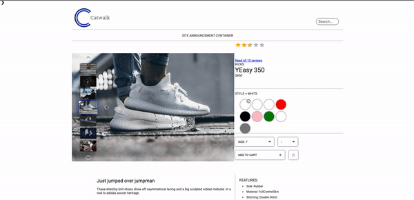
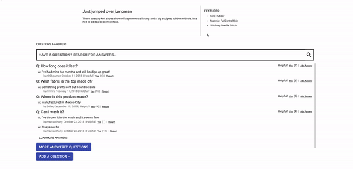
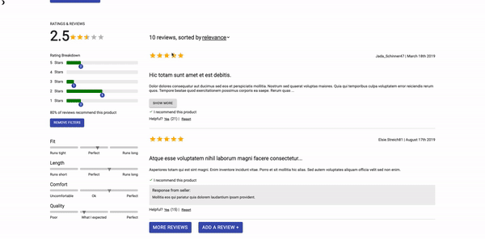
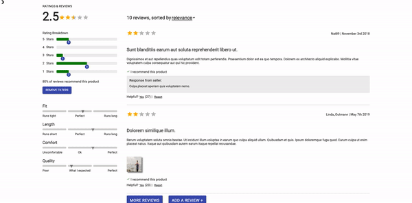

# Project Catwalk - Retail Web Application

This project was built by a team of 3 developers over the course of two weeks. The app
is built to the specifications of a 24 page business requirement document. The
primary technologies used are React (with React Hooks and custom styled
components), with Express to render data from a headless API, Material UI for
certain components, and CSS for general styling and custom component design.

## Components

### Product Overview

The top most section on each individual projects page. Designed to guide the
user through making selections for style and size.



### Questions and Answers

The Questions & Answers module allows asking and answering of questions for the
product selected. The functionality contained within this module can be divided
into several pieces:

- View questions
- Search for a question
- Asking a question
- Answering a question This component extends the ability to view and search
  questions, ask questions, answer questions and provide feedback on questions
  about the current product.



### Ratings and Reviews

The Ratings & Reviews module allows viewing and submission of reviews for the
product selected. The functionality contained within this module can be divided
into several pieces:

- Write new review
- Reviews List
- Sorting
- Rating Breakdown
- Product Breakdown This component extends the ability to write, read, and
  browse through reviews for the current product.



The heart of the Ratings and Reviews module is the list of reviews available for
the user to read. This list displays all the reviews that have been submitted
for the product being viewed.



## Building and installing env

First install dependencies:

```sh
npm install
```

To run node server:

```sh
npm start
```

To create a production build:

```sh
npm run build-prod
```

To create a development build:

```sh
npm run build-dev
```

## Running

Open the file `dist/index.html` in your browser

## Tech Stack

- [React](https://reactjs.org/)
- [Node](https://nodejs.org/en/)
- [Express](https://expressjs.com/)
- [AWS](https://aws.amazon.com/)

## Team

- Dylan Allgood - Rating and Reviews Module
  - https://github.com/dylanallgood
  - www.linkedin.com/in/dylanallgood
- Justin Umberger - Overview Module
  - https://github.com/Justin-WebDev
- Calvin Rudy - Questions and Answers Module
  - https://github.com/urbanseabear
